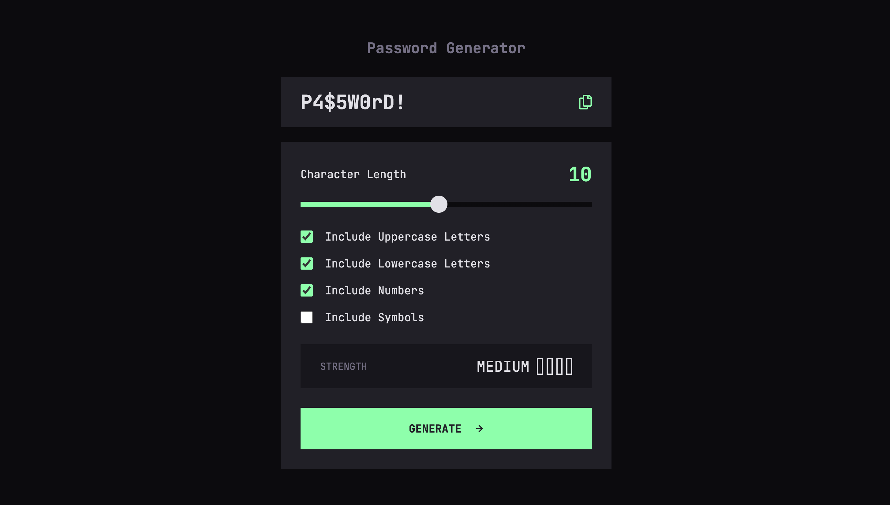

# Frontend Mentor - Password Generator App

This is my solution to the Password Generator App challenge on Frontend Mentor.

The goal of this project was to build a responsive password generator that allows users to customize their password and see its strength.

## Overview

### The challenge

Users should be able to:

- Generate a password based on selected character options
- Choose the password length using a range slider
- Include uppercase letters, lowercase letters, numbers, and symbols
- Copy the generated password to the clipboard
- See a strength rating for the generated password
- View the optimal layout depending on their device's screen size
- See hover and focus states for interactive elements

### Screenshot



### Links

- Solution URL: Add your Frontend Mentor solution URL here
- Live Site URL: Add your live site URL here

## My process

### Built with

- Semantic HTML5 markup
- CSS custom properties
- Flexbox
- Mobile-first workflow
- Responsive design
- Vanilla JavaScript
- Clipboard API
- Custom range slider and checkboxes
- JetBrains Mono local font

### What I learned

This project helped me practice working with JavaScript and DOM manipulation.

I learned how to read values from form controls and use them to generate a password:

```js
if (uppercaseCheckbox.checked) {
    availableCharacters += uppercaseChars;

    requiredCharacters.push(
        getRandomCharacter(uppercaseChars)
    );
}
```

I also practiced generating random values:

```js
function getRandomCharacter(characters) {
    const randomIndex = Math.floor(
        Math.random() * characters.length
    );

    return characters[randomIndex];
}
```

Another useful concept was shuffling the generated password so that the required character types do not always appear in the same order:

```js
function shufflePassword(password) {
    const characters = password.split("");

    for (let i = characters.length - 1; i > 0; i--) {
        const randomIndex = Math.floor(
            Math.random() * (i + 1)
        );

        [characters[i], characters[randomIndex]] =
            [characters[randomIndex], characters[i]];
    }

    return characters.join("");
}
```

I also learned how to copy text to the clipboard using the Clipboard API:

```js
await navigator.clipboard.writeText(password);
```

This project also gave me more practice with event listeners, arrays, loops, functions, conditional logic, CSS custom properties, and responsive layouts.

### Continued development

In future projects, I want to continue improving my JavaScript fundamentals, especially:

- DOM manipulation
- Functions
- Arrays and loops
- Event handling
- Form validation
- Writing cleaner and more reusable code
- Accessibility
- Responsive CSS

I also want to become more comfortable building functionality from scratch without relying on frameworks.

### AI Collaboration

I used ChatGPT as a learning and debugging assistant during this project.

AI helped me:

- Understand how to structure the JavaScript
- Debug issues in HTML, CSS, and JavaScript
- Understand relative file paths
- Build the password generation logic step by step
- Implement the password strength indicator
- Implement clipboard functionality
- Improve the custom slider and checkbox styling

Rather than using a framework or external library, the final functionality was implemented with vanilla JavaScript.

## Author

- Frontend Mentor - [@doomyhub229](https://www.frontendmentor.io/profile/doomyhub229)
- GitHub - [@doomyhub229](https://github.com/doomyhub229)